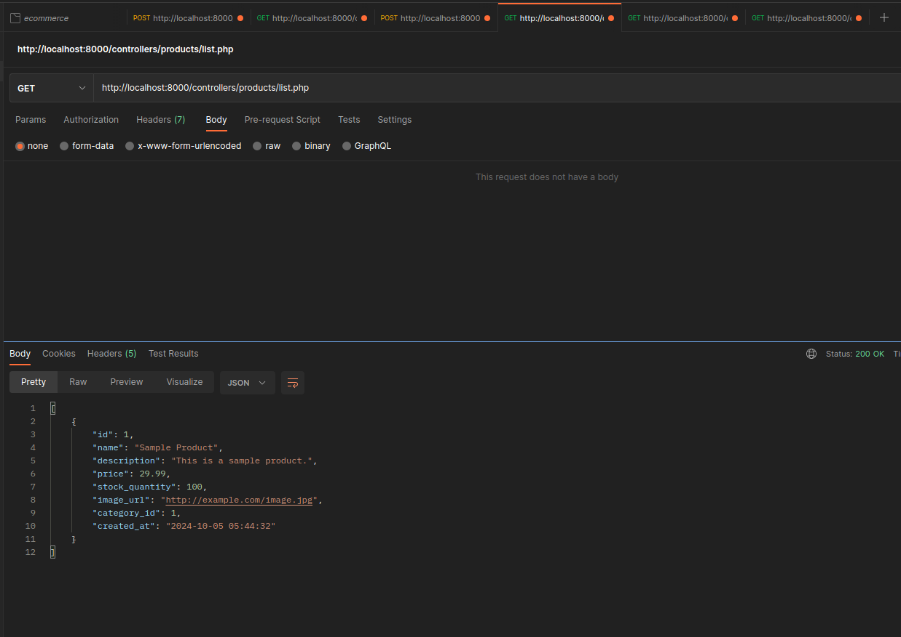
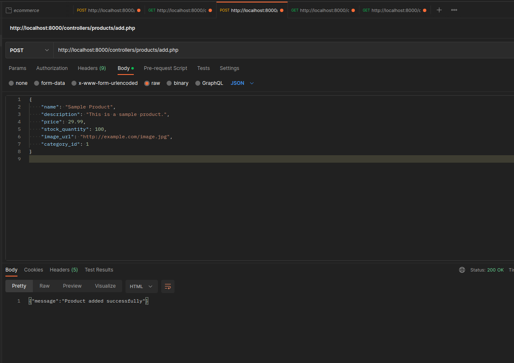
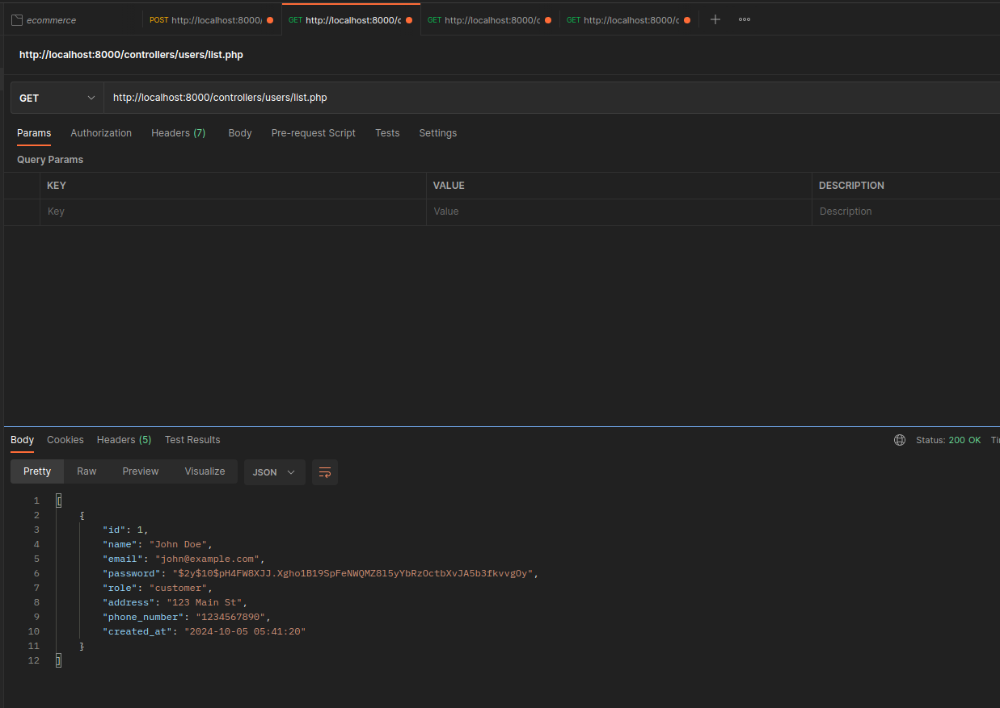
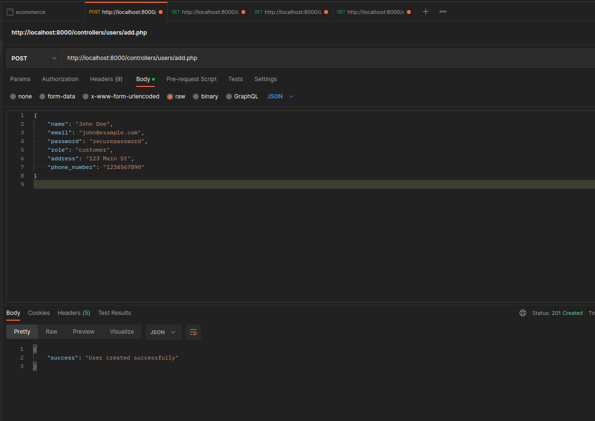
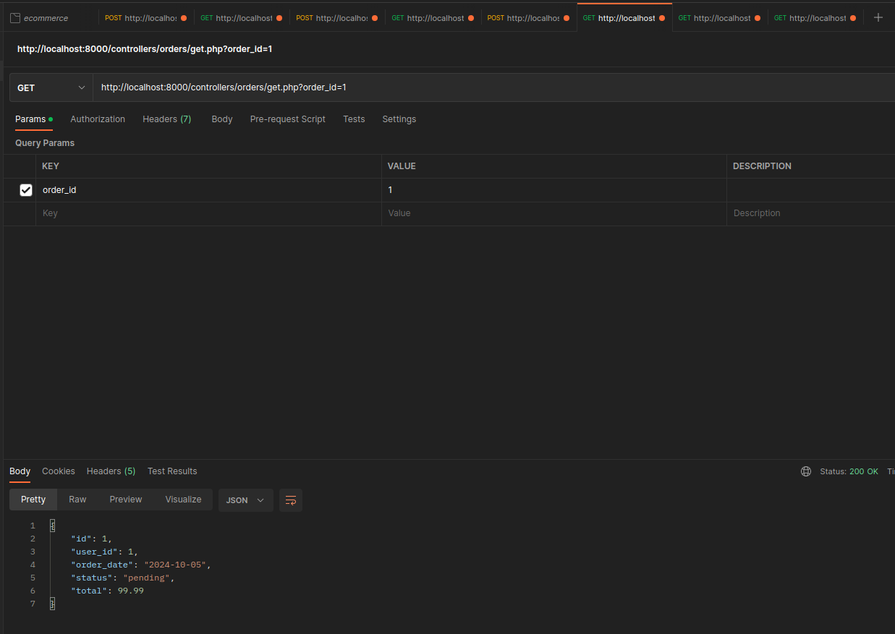

# E-Commerce PHP API with SQLiteProject

This is a simple eCommerce application built using PHP and SQLite. The project follows RESTful conventions and exposes endpoints for managing users, products, orders, payments, and carts.

## Installation

1. Clone the repository:
git clone https://github.com/yourusername/ecommerce_project.git

2. Navigate to the project directory:
cd ecommerce_project

3. Set up the SQLite database:
sqlite3 database/ecommerce.db < database/schema.sql

4. Start your PHP server:
php -S localhost:8000

5. Use Postman or curl to test the routes.

## Endpoints

- `/products/list.php`: Lists all products
- `/products/add.php`: Adds a product
- `/users/list.php`: Lists all users
- `/users/add.php`: Adds a user
- `/orders/list.php`: Lists all orders

...

## Postman Collection

### List Products

### Add Product

### List Users

### Add User

### List Orders

The Postman collection for testing the API routes is available in the `/postman_tests/` directory.

## Database

The database file (`ecommerce.db`) is located in the `/database/` directory. The schema includes tables for users, products, orders, payments, and carts.
